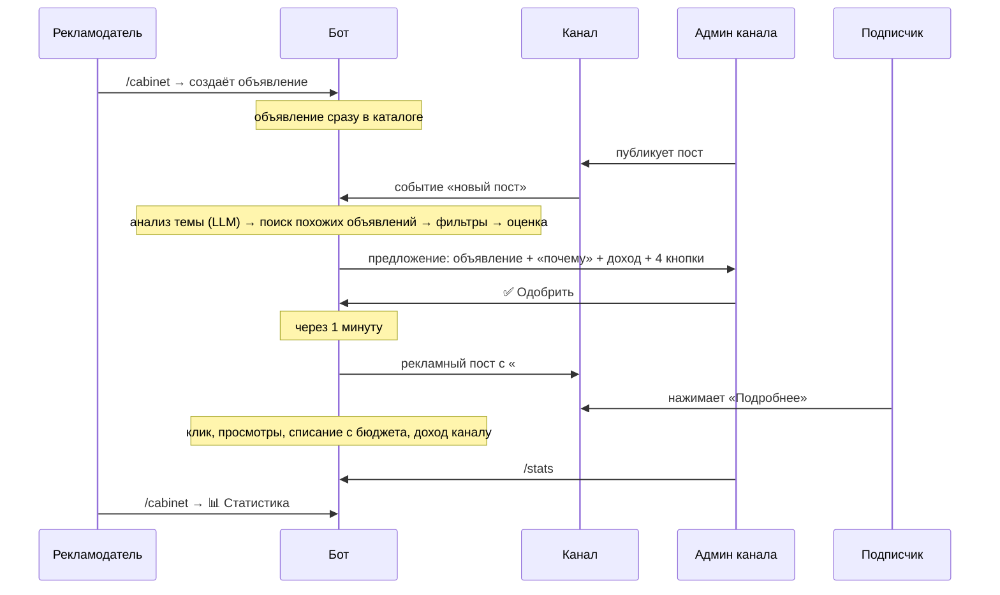

# Контекст для фронтенда: как пользователи работают с ctxads

Документ для дизайнера, фронтенд-разработчика или ИИ-агента, который будет делать веб-интерфейс
или мини-приложение MAX поверх бота. Сейчас весь интерфейс — это чат-бот `@t425_hakaton_max_bot`
в MAX: сообщения и inline-кнопки. Фронтенд должен повторять те же сценарии, правила и данные.

Описано фактическое поведение кода на 28.09.2026. Если что-то расходится с кодом, прав код:
тексты — `src/ctxads/bot/texts.py`, правила подбора — `src/ctxads/matching/`,
кабинет — `src/ctxads/bot/handlers/cabinet.py`.

---

## 1. Продукт в двух словах

Контекстная реклама в каналах MAX. Бот — администратор канала. Когда в канале выходит пост,
бот понимает его тему, подбирает рекламу, подходящую **именно к этому посту**, и предлагает её
админу в личке. Админ одобряет — реклама выходит в канал с маркировкой, бот считает просмотры,
клики и деньги.

Главные обещания, которые интерфейс должен передавать:

- **Реклама к месту.** Не случайный баннер, а объявление по теме поста, с объяснением «почему».
- **Контроль у админа.** Без его «да» ничего не публикуется. Он может отклонить, попросить
  другой вариант, запретить целую категорию.
- **Прозрачные деньги.** Модель оплаты, цена и ожидаемый доход видны до решения.

## 2. Роли

| Роль | Кто это | Где сейчас работает | Что делает |
|---|---|---|---|
| **Админ канала** | владелец канала в MAX | личка с ботом | подключает канал, решает по предложениям, настраивает категории, смотрит доход |
| **Рекламодатель** | компания или бренд | личка с ботом, `/cabinet` | создаёт объявления, управляет бюджетом, смотрит статистику |
| **Подписчик канала** | читатель | канал | видит рекламный пост, нажимает «Подробнее» |
| **Платформа** | мы | нет интерфейса | берёт 30% комиссии; модерации объявлений в MVP нет |

Один и тот же пользователь MAX может быть и админом, и рекламодателем — это один бот.

## 3. Сквозной сценарий



## 4. Путь админа канала

### 4.1. Знакомство и согласие (`/start`)

1. Пользователь пишет боту `/start` (или открывает бота впервые).
2. Бот объясняет, как всё работает, и показывает условия:
   - оферта: доход — доля от оплаты рекламодателя, **70% каналу, 30% платформе**;
   - обработка данных: храним только ID в MAX, имя и факт согласия; данные подписчиков не
     собираем; в LLM уходит только публичный текст постов.
3. Кнопка **«✅ Принимаю»**. После нажатия — инструкция, как добавить бота в канал.
4. Повторный `/start` после согласия: «Условия уже приняты».

Без согласия канал не подключается: если бота добавили в канал раньше, бот попросит нажать
`/start`, а после согласия подключит канал сам.

### 4.2. Подключение канала

1. Админ добавляет бота **администратором канала** с правами:
   - «Читать все сообщения» — обязательно, иначе бот не видит посты;
   - «Публиковать сообщения» — обязательно;
   - «Удалять сообщения» — по желанию: тогда бот удаляет свою рекламу через 48 часов.
2. Бот проверяет права и отвечает в личку:
   - **успех:** «✅ Канал «…» подключён. Подписчиков: N. Профиль: …» — профиль бот строит сам
     по последним 20 постам (например, «Канал о темах: здоровье и ЗОЖ, спорт»);
   - **не хватает прав:** «⚠️ Канал «…»: не хватает прав (…)» с инструкцией. Когда права
     выдадут, бот перепроверит их автоматически.
3. Если бота удалили из канала: открытые предложения отменяются, админу приходит уведомление.

Статусы канала: `pending_consent` (ждёт согласия), `insufficient_rights` (не хватает прав),
`active`, `paused` (пауза из настроек), `removed`.

### 4.3. Предложение рекламы — главный экран

Когда в активном канале выходит пост, бот присылает админу в личку:

```
📌 Новый пост в «AI marketing»: «Мой опыт из Черногории. Я никогда не забуду…»
💡 Предлагаем: Туры в Черногорию
🧠 Почему: <1–2 предложения от LLM, почему объявление подходит к посту>
💰 Модель: CPM 300 ₽ за 1000 показов · ожидаемо ~630 ₽ за размещение
⏳ Предложение действует до 14:32

[✅ Одобрить] [❌ Отклонить]
[🔄 Другой вариант]
[🚫 Не предлагать «Путешествия»]
```

Что содержит карточка: превью поста (первые ~60 символов), название канала, заголовок
объявления, объяснение, модель оплаты и цена, **ожидаемый доход канала за размещение**,
срок действия (2 часа).

Действия и результат (сообщение редактируется, кнопки исчезают):

| Кнопка | Что происходит | Итоговый текст |
|---|---|---|
| ✅ Одобрить | публикация через 1 минуту | «✅ Одобрено, выйдет в 12:43.» → позже отдельное сообщение «📣 Реклама «…» опубликована в «…»» |
| ❌ Отклонить | это объявление не предлагается в канале 14 дней | «❌ Отклонено…» |
| 🔄 Другой вариант | следующий кандидат к тому же посту (до 3 раз) | карточка обновляется новым объявлением или «Других подходящих вариантов нет» |
| 🚫 Не предлагать «X» | категория X попадает в блоклист канала | «🚫 Категория «X» больше не предлагается. /settings — вернуть.» |
| (истёк срок) | — | «⌛ Предложение истекло.» |

Нажимать может только владелец канала. Остальным — всплывашка «Решение принимает владелец
канала». По неактуальной карточке — «Предложение уже неактуально».

Если публикация не удалась (права отозвали, кончился бюджет рекламодателя, превышен дневной
лимит, канал отключён), админу приходит «Не удалось опубликовать «…»: <причина>».

### 4.4. Когда предложения не будет

Сейчас бот в этих случаях **молчит**, причина пишется только в базу (`posts.skip_reason`).
Для фронтенда это важное место: админ не понимает, почему к посту ничего не пришло.

| Причина (`skip_reason`) | Что значит |
|---|---|
| `too_short` | пост короче 80 символов |
| `open_proposal` | уже есть неразобранное предложение в этом канале |
| `too_few_posts` | с прошлой рекламы вышло меньше 3 обычных постов |
| `too_soon` | с прошлой рекламы прошло меньше 120 минут |
| `daily_limit` | уже 3 рекламы за сутки |
| `unsafe` | пост небезопасен для рекламы (трагедии, политика и т. п.) |
| `no_match` | ни одно объявление не подошло достаточно хорошо |
| `llm_unavailable`, `analysis_invalid` | нейросеть недоступна или ответила некорректно |

### 4.5. Настройки канала (`/settings`)

Если каналов несколько — сначала список каналов со статусами. Экран канала:

- статус (🟢 активен / ⏸ на паузе / …);
- **категории рекламы** — сетка кнопок по 2 в ряд:
  - обычные категории включены по умолчанию, нажатие блокирует (✅ ↔ 🚫);
  - **регулируемые** (⚖️ Медицина, Финансы, Ставки, Алкоголь) выключены по умолчанию,
    нажатие разрешает (⚖️ ↔ ✅);
- автоудаление: «удаляю рекламу через 48 ч» или «нет права «Удалять сообщения»…»;
- кнопка «⏸ Приостановить» / «▶️ Возобновить» — пауза всего канала;
- «← К списку каналов».

Остальные параметры канала (частота, задержка публикации, время жизни рекламы) в интерфейсе
бота не настраиваются — только в базе. Кандидаты для фронтенда.

### 4.6. Статистика (`/stats`)

По каждому каналу за 7 и 30 дней: размещений, просмотров, кликов, **заработано** (доля канала).

## 5. Путь рекламодателя (`/cabinet`)

### 5.1. Первый вход

1. `/cabinet` → бот объясняет кабинет и модели оплаты и спрашивает **название компании или
   бренда** (1–100 символов). Оно идёт в маркировку рекламы.
2. После ответа — меню кабинета. Больше название не спрашивается.

### 5.2. Меню кабинета

```
💼 Кабинет рекламодателя «madmat»
Объявлений: 2, показываются: 1. Остаток бюджета: 3 500 ₽
Выберите объявление или создайте новое.

[🟢 Туры в Черногорию]
[⏸ Отели в Будве]
[➕ Новое объявление]
[📊 Статистика]
```

Статус объявления: 🟢 показывается / ⏸ на паузе / ⚠️ бюджет исчерпан.

### 5.3. Создание объявления — мастер из 7 шагов

| Шаг | Ввод | Правила |
|---|---|---|
| 1 | заголовок | 1–100 символов |
| 2 | текст | 1–1000 символов |
| 3 | ссылка | только `http://` или `https://`, без пробелов |
| 4 | категория | кнопки, 16 категорий (все, кроме «Другое») |
| 5 | модель оплаты | кнопки: CPM — за 1000 показов, CPC — за клик, CPA — за целевое действие |
| 6 | цена, ₽ | число > 0, до 2 знаков после запятой; понимает «1 500», «250,5», «300 ₽» |
| 7 | бюджет, ₽ | не меньше цены; пополнение демо, без оплаты |

При ошибке бот объясняет, что не так, и ждёт повторного ввода. На шагах с кнопками текст не
принимается («Выберите вариант кнопкой»). `/cancel` или любая другая команда прерывает мастер.

Дальше **превью** — ровно так, как пост будет выглядеть в канале (заголовок, текст,
маркировка), плюс ссылка, категория, цена, бюджет. Кнопки «✅ Запустить» / «❌ Отмена».
После запуска: «🚀 Объявление запущено…» и карточка объявления. Объявление **сразу** участвует
в подборе — модерации нет.

### 5.4. Карточка объявления

```
📄 Туры в Черногорию
<текст объявления>

🔗 https://t.me/stbuk
🏷 Путешествия · 💰 CPM 300 ₽ за 1000 показов
Статус: 🟢 показывается
Бюджет: осталось 2 870 ₽ из 3 000 ₽
Размещений 3 · просмотров 430 · кликов 12 · потрачено 130 ₽

[✏️ Заголовок] [✏️ Текст]
[✏️ Ссылка] [🏷 Категория]
[💰 Цена] [➕ Пополнить бюджет]
[⏸ Приостановить]
[← К объявлениям]
```

- **Правка** — тот же ввод с теми же правилами, что в мастере. После смены заголовка, текста
  или категории бот пересчитывает, к каким постам объявление подходит.
- **Пауза** — объявление перестаёт предлагаться каналам; уже вышедшие посты остаются.
- **Пополнить бюджет** — сумма добавляется к общему бюджету и остатку (демо, без оплаты).
- Чужие объявления открыть и изменить нельзя.

### 5.5. Статистика рекламодателя

«📊 Статистика»: итог по всем объявлениям (размещения, просмотры, клики, потрачено) и строка
по каждому объявлению с остатком бюджета.

## 6. Что видит подписчик канала

Обычный пост в канале:

```
Туры в Черногорию

<текст объявления>

#Реклама. madmat. erid: DEMO-3F9A1C2B7D

[Подробнее]
```

- Маркировка: `#Реклама. {юрлицо}, ИНН {ИНН}. erid: {ERID}`; у рекламодателей из кабинета ИНН
  нет — `#Реклама. {название}. erid: …`.
- «Подробнее» ведёт через трекер кликов на ссылку рекламодателя с utm-метками. Без публичного
  адреса сервера (локальный запуск) — сразу на ссылку рекламодателя, клики не считаются.
- Если у бота есть право удаления, пост удаляется через 48 часов.

## 7. Справочник правил

### 7.1. Категории

Здоровье и ЗОЖ, Медицина ⚖️, Спорт, Еда, Технологии, Образование, Финансы ⚖️, Путешествия,
Красота, Дети и семья, Авто, Дом и ремонт, Развлечения, Бизнес, Ставки ⚖️, Алкоголь ⚖️, Другое.
⚖️ — регулируемые: предлагаются, только если админ разрешил их в настройках канала.
Коды — в `src/ctxads/matching/categories.py`.

### 7.2. Как бот выбирает объявление

1. Частотные правила (см. 4.4) — до вызова нейросети.
2. Нейросеть определяет тему, категорию и безопасность поста.
3. Поиск 20 самых похожих по смыслу объявлений (эмбеддинги, pgvector).
4. Фильтры: блоклист и регулируемые категории канала, остаток бюджета, отклонённые за 14 дней,
   одно объявление не чаще раза в 7 дней в одном канале, пауза.
5. Оценка: `0.6 × похожесть на пост + 0.25 × похожесть на профиль канала + 0.15 × выплата`.
   Ниже порога 0.35 — «ничего не подходит».
6. Объяснение «почему» — от нейросети.

### 7.3. Деньги

- **Списания с рекламодателя:** CPM — по приросту просмотров (опрос каждые 30 минут в течение
  72 часов после публикации); CPC — за уникальный клик (повторный клик с того же IP в течение
  24 часов не считается); CPA — по постбэку рекламодателя.
- **Раздел:** 70% каналу, 30% платформе.
- **Ожидаемый доход в предложении** — грубый прогноз: охват = подписчики × 30%;
  CPM: цена × охват / 1000; CPC: × CTR 1%; CPA: × CTR 1% × конверсия 5%. Затем 70% каналу.
  У маленьких каналов это копейки — интерфейсу стоит это нормально показывать.
- Платежей в MVP нет: суммы только считаются.

### 7.4. Статусы

| Сущность | Статусы |
|---|---|
| Канал | `pending_consent`, `insufficient_rights`, `active`, `paused`, `removed` |
| Предложение | `pending`, `approved`, `published`, `rejected`, `expired`, `superseded` (заменено «другим вариантом»), `cancelled` |
| Объявление | `active`, `paused`; «бюджет исчерпан» — вычисляемое: `active` и остаток ≤ 0 |

### 7.5. Числа по умолчанию

| Параметр | Значение |
|---|---|
| минимальная длина поста | 80 символов |
| срок жизни предложения | 2 часа |
| задержка публикации после одобрения | 1 минута |
| между рекламой в канале | ≥ 3 поста и ≥ 120 минут |
| рекламы в канале в сутки | ≤ 3 |
| «Другой вариант» на один пост | до 3 раз |
| автоудаление рекламы | 48 часов (если есть право) |

## 8. Данные для экранов

Основные таблицы (`src/ctxads/db/models.py`):

- `channels` — канал: название, владелец, подписчики, статус, права бота, профиль.
- `channel_settings` — блоклист категорий, разрешённые регулируемые, частота, задержка, TTL.
- `posts` — посты канала: текст, анализ нейросети (тема, категория, безопасность),
  `skip_reason`.
- `proposals` — предложения: пост, объявление, оценка, «почему», ожидаемый доход, статус, сроки.
- `placements` — вышедшая реклама: ссылка-трекер, время публикации, просмотры.
- `clicks`, `conversions`, `ledger_entries` — клики, конверсии, проводки (списание, доход канала,
  комиссия).
- `advertisers` — рекламодатели (у созданных в боте есть `owner_user_id`).
- `ads` — объявления: заголовок, текст, ссылка, категория, модель, цена, бюджет, статус.

## 9. Что есть снаружи бота сейчас

HTTP-сервер (порт 8000):

| Адрес | Что |
|---|---|
| `GET /showcase` | витрина рекламодателя: все объявления, бюджеты, размещения, клики — только чтение, без входа |
| `GET /r/{token}` | трекер клика → 302 на рекламодателя |
| `GET /postback?click_id=&amount=&sig=` | конверсия CPA от рекламодателя |
| `GET /healthz` | проверка живости |

**API для фронтенда нет.** Для веб-интерфейса или мини-приложения понадобятся:

- эндпоинты чтения и записи для сценариев из разделов 4 и 5 (можно переиспользовать
  доменный код: `matching/`, `ads/cabinet.py`, `db/repo/`);
- вход: пользователь идентифицируется по MAX `user_id`. Для веба — например, одноразовая ссылка
  от бота; для мини-приложения MAX — его механизм авторизации (API мини-приложений ещё не изучали).

## 10. Ограничения MVP, которые должны быть видны в интерфейсе

- Оплаты нет: пополнение бюджета — демо.
- ERID демонстрационный, ОРД не подключён; в кабинете не спрашивается ИНН.
- Модерации объявлений нет.
- Клики считаются только при публичном HTTPS-адресе сервера.
- Предложения к одному каналу идут по одному: пока есть неразобранное, новые посты пропускаются.

## 11. Где фронтенд может заметно улучшить опыт

Идеи, а не требования:

- **Лента постов канала с причинами**, почему к посту не было рекламы (раздел 4.4) — сейчас
  это главный источник вопросов «бот сломался?».
- Предпросмотр рекламного поста рядом с исходным постом в карточке предложения.
- Настройки частоты, задержки и автоудаления, которых нет в боте.
- Графики просмотров, кликов и дохода вместо текстовой сводки.
- Для рекламодателя: в каких каналах вышло объявление, и превью «к каким постам оно подойдёт».
